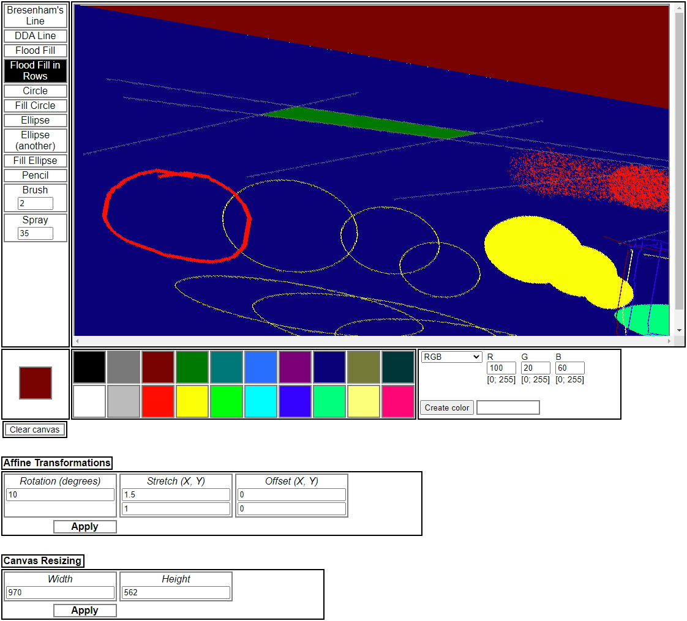

# Basic-Paint-JS
Really basic paint app that can run in browser.\
Written in pure JavaScript.\
This app was created during Computer Graphics course.
## Features
* Simple instruments to work with (line, circle, ellipse, etc)
* Affine transformations of the canvas (rotation, stretch, offset)
* Ability to work with different color models (RGB, HSV, CMY, CMYK)
## Screenshot

